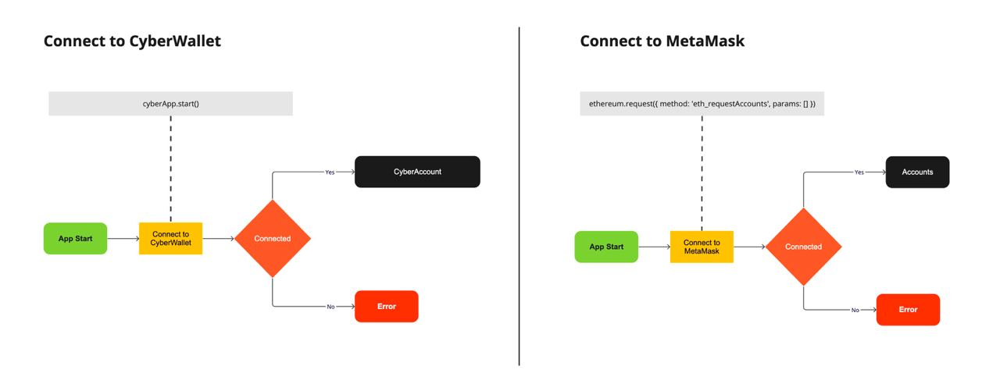
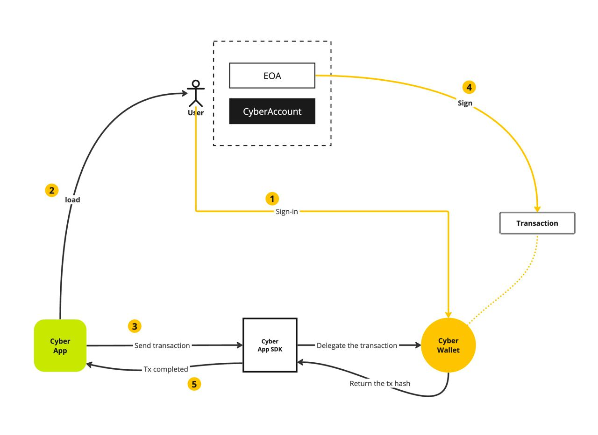

# Overview

CyberApps are web apps that support CyberWallet. CyberApps are loaded via [**iframe**](https://developer.mozilla.org/en-US/docs/Web/HTML/Element/iframe) on the CyberWallet website ([wallet.cyber.co](https://wallet.cyber.co)). Before supporting CyberWallet, a CyberApp should be able to work with MetaMask smoothly. With CyberApp SDK, developers can easily integrate CyberWallet by modifying two parts, as outlined below:

## Establish connection

To begin, a CyberApp needs to establish a connection with the CyberWallet webpage. To initiate the connection request, simply call `cyberApp.start()`. If the app and CyberWallet are successfully connected, the method will return current user's CyberWallet detail.

## Send transaction

Transactions sent from CyberApps will be delegated to CyberWallet for user to sign. CyberWallet will display a confirmation modal to the user, showing the transaction details. Once the user has reviewed and signed the transaction, CyberWallet will send the transaction and provide the transaction hash back to the app.

